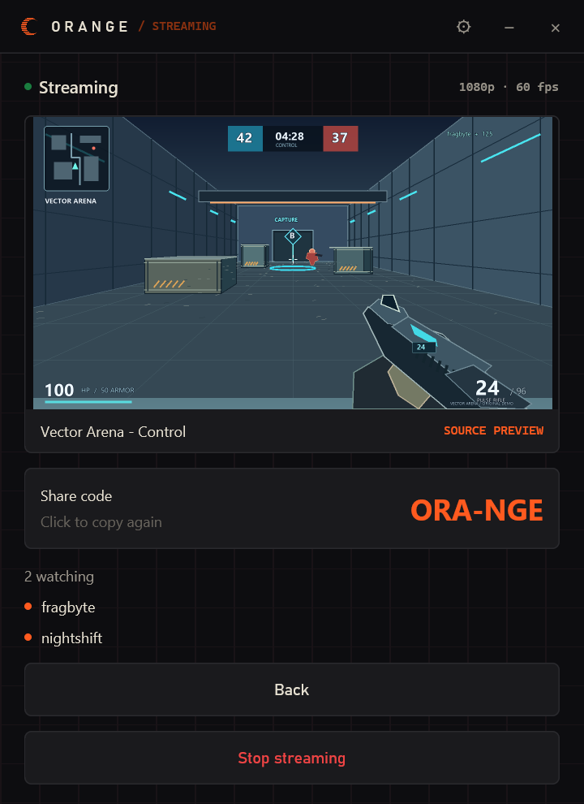

  

<h1 align="center">orange</h1>

  Share your game with friends, live, straight from your PC.

  <a href="https://orangealpha0d8d5893e69a3.z15.web.core.windows.net/"><strong>Download for Windows</strong></a> 
  Windows 10 / 11, 64-bit · Free beta

  🇧🇷 <a href="README.pt-BR.md"><strong>Leia em português</strong></a>

Orange streams a game window (picture **and** game sound) directly from the
host PC to each viewer. No server re-encode, no account needed to join:
the host sends a room code, the viewer pastes it, done.

## Watch

1. Install Orange (both sides need it).
2. Get the room code from the host.
3. Open Orange → **Join with a code** → paste it.

## Host

1. Open Orange → **Start streaming**.
2. Pick a quality, click your game's preview. It starts immediately.
3. Click the **Share code** to copy it and send it to your friends.

## Friends (no codes every time)

1. Both sides sign in with Discord.
2. **Add friend** with their personal friend code → **Send request**.
   They accept in **Requests**; one accept adds both sides.
3. When a friend is live, just press **Join**.

Friend code adds the person; room code joins one stream.

## The one audio rule

- **Game window** → viewers hear the game only.
- **Full display** → viewers hear **everything**, including call voices.
  Only use it when audio doesn't matter for the call.

## Good to know

- Each viewer gets their own stream from your PC: your **upload** is the
  limit (~18 Mbps per viewer at 1080p60).
- Anyone with the room code can join and pass it on.
- Needs Windows 10/11 64-bit with a hardware H.265/H.264 encoder and
  updated graphics drivers.
- The beta installer isn't signed, so SmartScreen warns about an unknown
  publisher. Expected during the beta.
- Networks requiring a TURN relay aren't supported yet.

## If something doesn't work

**Settings → Troubleshooting → Troubleshoot**, then **Fix connection** if
offered (Windows may ask permission). Still stuck? **Send report** (signed
in) or **Copy report**. Nothing uploads automatically.

## For developers

Start with [ARCHITECTURE.md](ARCHITECTURE.md), then
[CONTRIBUTING.md](CONTRIBUTING.md).

## License

MIT — see [LICENSE](LICENSE). Third-party runtime licences are detailed in
[CONTRIBUTING.md](CONTRIBUTING.md#license-notes).
