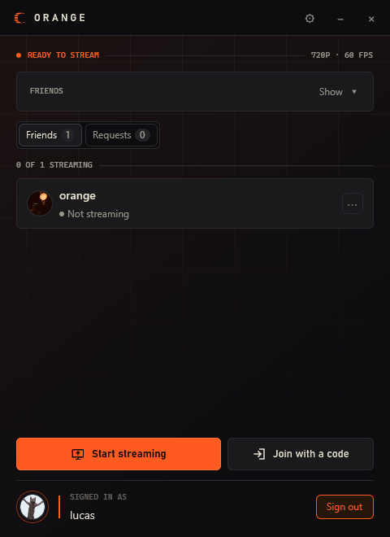
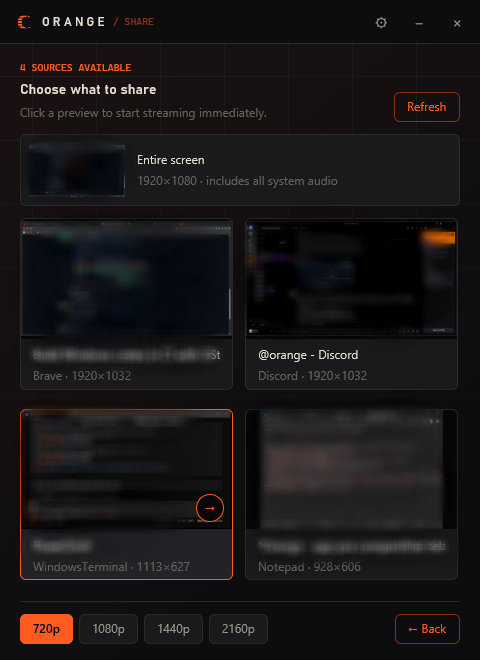

  

<h1 align="center">orange</h1>

  Mostre seu jogo para os amigos, ao vivo, direto do seu PC.

  <a href="https://orangealpha0d8d5893e69a3.z15.web.core.windows.net/"><strong>Baixar para Windows</strong></a> 
  Windows 10 / 11, 64-bit · Beta grátis

  🇺🇸 <a href="README.md"><strong>Read in English</strong></a>

  
  

O Orange transmite a janela do jogo (imagem **e** som do jogo) direto do PC
de quem transmite para cada viewer. Sem re-encode no servidor, sem conta
para entrar: o host manda o código da sala, o viewer cola, pronto.

## Assistir

1. Instale o Orange (os dois lados precisam).
2. Peça o código da sala para o host.
3. Abra o Orange → **Join with a code** → cole o código.

## Transmitir

1. Abra o Orange → **Start streaming**.
2. Escolha a qualidade e clique na janela do jogo. Começa na hora.
3. Clique no código da sala para copiar e mande para os amigos.

## Amigos (sem código toda vez)

1. Os dois entram com Discord.
2. **Add friend** com o código de amigo da pessoa → **Send request**.
   Ela aceita em **Requests**; um aceite adiciona os dois lados.
3. Quando um amigo estiver ao vivo, é só apertar **Join**.

Código de amigo adiciona a pessoa; código de sala entra numa transmissão.

## A regra de ouro do áudio

- **Janela do jogo** → os viewers ouvem só o jogo.
- **Tela cheia** → os viewers ouvem **tudo**, incluindo a voz da call.
  Só use se o áudio não importar.

## Bom saber

- Cada viewer recebe um stream separado do seu PC: seu **upload** é o
  limite (~18 Mbps por viewer em 1080p60).
- Quem tiver o código entra e pode repassar.
- Precisa de Windows 10/11 64-bit com encoder H.265/H.264 e driver
  atualizado.
- O instalador beta não é assinado, então o SmartScreen avisa. É esperado.
- Redes que exigem relay TURN não funcionam ainda.

## Deu problema?

**Settings → Troubleshooting → Troubleshoot** e **Fix connection** se
oferecer (o Windows pode pedir permissão). Continuou? **Send report**
(logado) ou **Copy report**. Nada é enviado sozinho.
